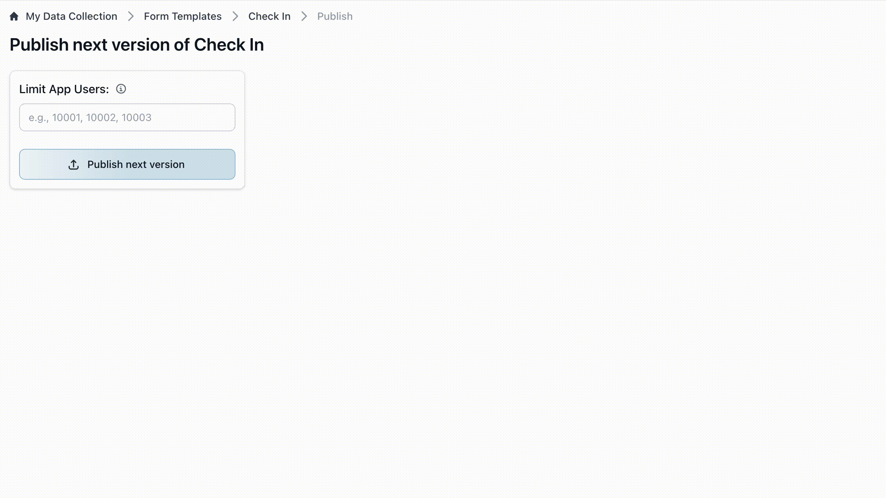

.. Publish MDM documentation master file, created by
   sphinx-quickstart on Tue Feb 11 11:34:13 2025.
   You can adapt this file completely to your liking, but it should at least
   contain the root `toctree` directive.

Publish MDM
===========

Publish MDM is a open-source tool to publish XLSForm templates from Google
Sheets to `ODK Central <https://getodk.org/>`_. It offers support for single
sign-on with Google, project template variables, and a user-friendly interface
for publishing form versions.

   Sample Publish MDM interface

.. toctree::
   :maxdepth: 2
   :caption: Contents:

   src/topics/index
   src/running/index
   src/local-development/index
   src/contributing

Contributors:

.. contributors:: caktus/publish-mdm
