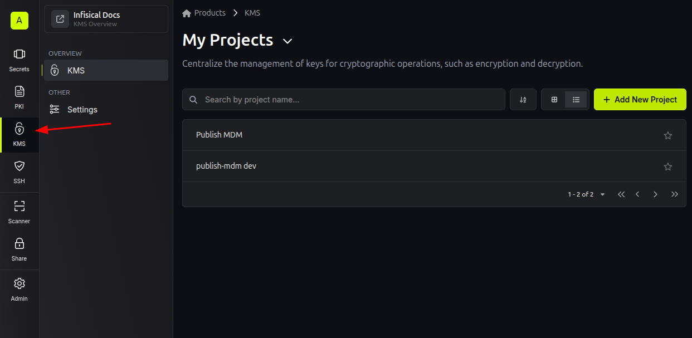
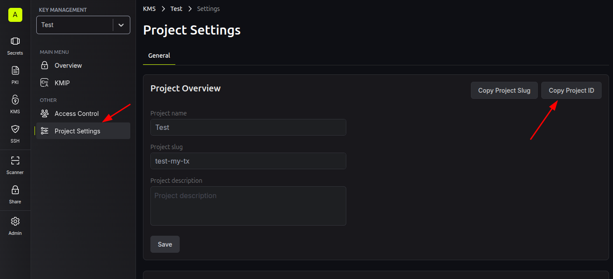
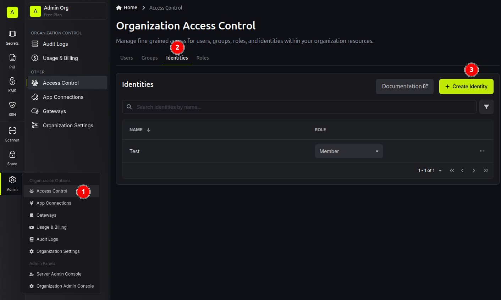
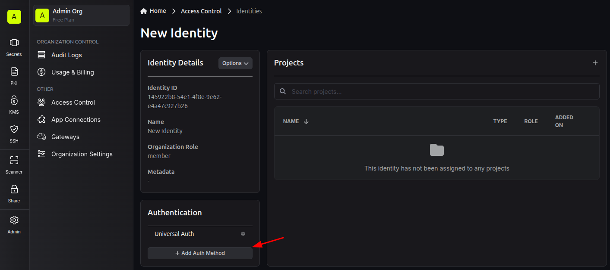
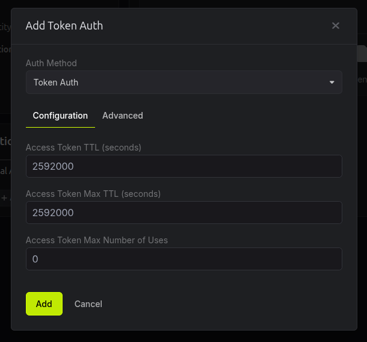
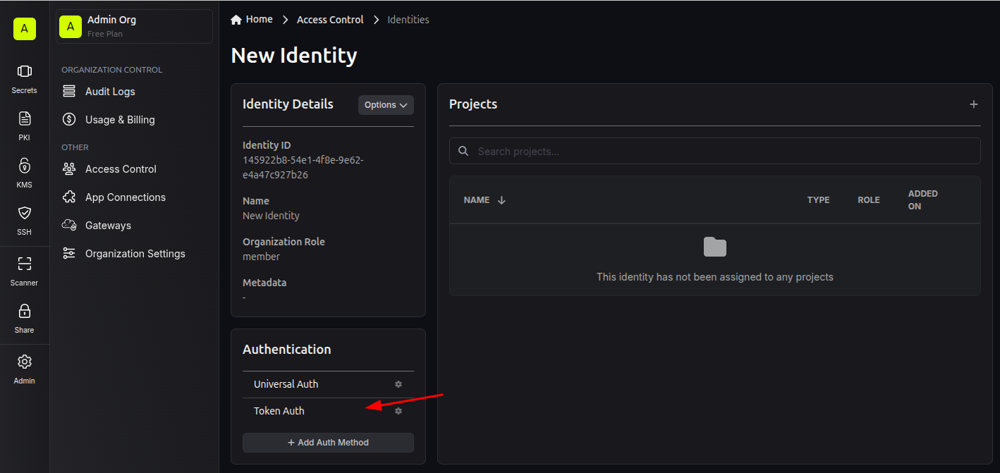
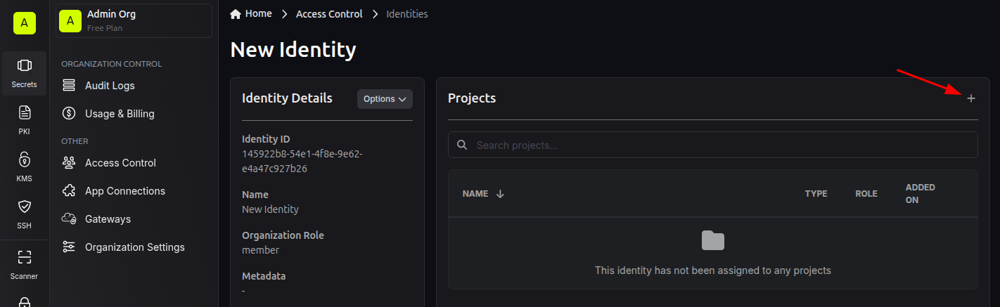

Inifisical
==========

`Infisical <https://infisical.com/>`_ is used for secrets management within the project,
particularly for encrypting ODK Central credentials before storing them in the database.
This guide will walk you through setting up a project and an access token in Infisical.

Deploying Infisical
-------------------

If you are running Publish MDM locally and you followed :doc:`Quickstart with Docker <docker-compose>`, Infisical should
be running at ``http://localhost:8888``.

If you deployed Publish MDM using `our Helm chart <https://github.com/caktus/helm-charts/tree/main/charts/publish-mdm>`_
and you had enabled Infisical in the chart's values, it should be running at the domain name that you set up for it.

See `Infisical's documentation <https://infisical.com/docs/self-hosting/overview>`_ for other self-hosting options.

If you prefer not to self-host, you can sign up for an `Infisical Cloud <https://app.infisical.com/>`_ account.

The URL you use to access Infisical will be your value for the ``INFISICAL_HOST`` environment variable.

.. _infisical:setup:

Setting up a KMS Project
------------------------

Go to the KMS page in Infisical and create a project:

In the new project's Overview Page, click on Project Settings and then copy the project's ID.
You will use it to set the ``INFISICAL_PROJECT_ID`` environment variable:

Setting up an Access Token
--------------------------

Under the Admin menu on the left sidebar, click on Access Control, go into the Identities tab
in the Organization Access Control page, and create an `Identity <https://infisical.com/docs/documentation/platform/identities/overview>`_.
You can select a "Member" role for the Identity.

In the Identity's page, click on Add Auth Method:

In the resulting dialog select "Token Auth" under "Auth Method". You can edit the other values in the form as needed:

After adding the Auth Method, click on Token Auth, then in the resulting dialog click on Add Token. Copy
the token that will be displayed. You will use it to set the ``INFISICAL_TOKEN`` environment variable:

Lastly, add the Identity to the Project you created earlier:

